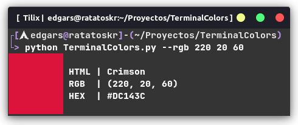
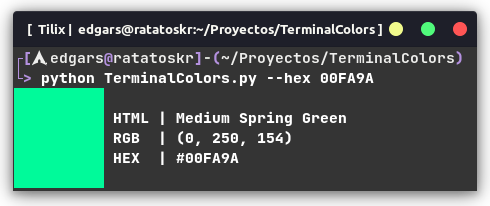
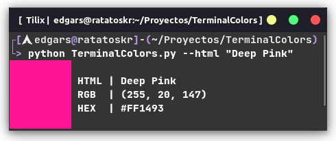

# Terminal Colors

A simple program that recieves an RGB value, Hexadecimal value, or HTML name, and prints that color on terminal.

## Examples

Getting color by RGB

    python TerminalColors.py --rgb 220 20 60

Getting color by hexadecmial

    python TerminalColors.py --hex 00FA9A

Getting color by HTML Name

    python TerminalColors.py --html "Deep Pink"

## Usage

    python TerminalColors.py --rgb R G B

Prints the color by getting it from its RGB value,
the values must be in the range of 0-255

    python TerminalColors.py --hex HEX

Prints the color by getting it from its hexadecimal value,
this must be given without the # character

    python TerminalColors.py --html NAME

Tries to find the color by its name in the colors file.
It uses a CSV list by codebrainz (Thank You!):
https://github.com/codebrainz/color-names.git
